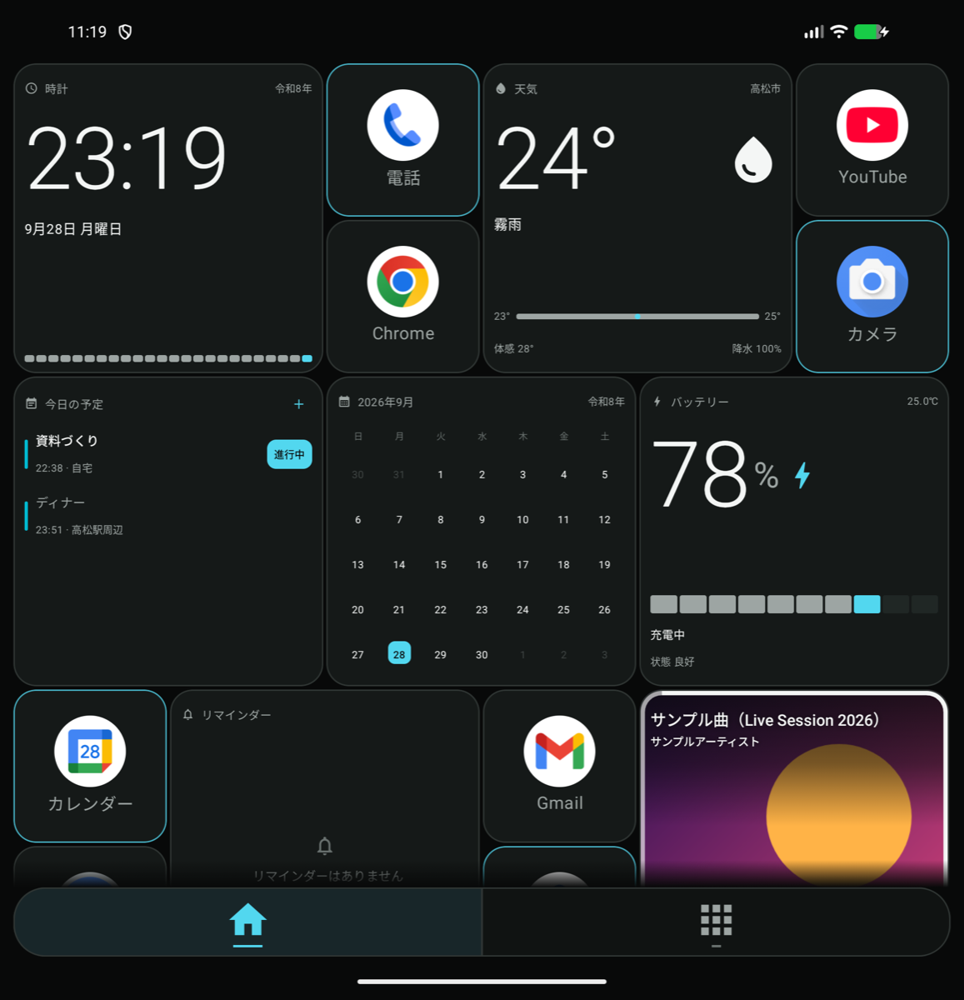
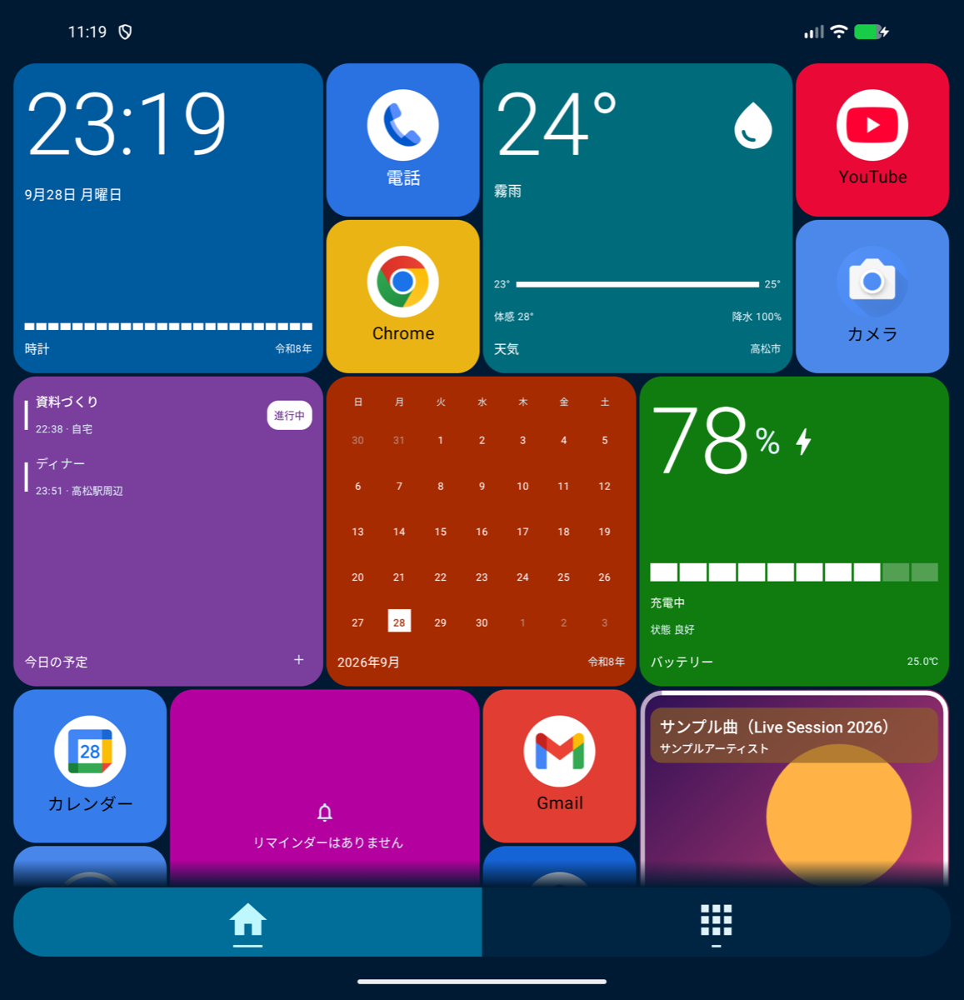
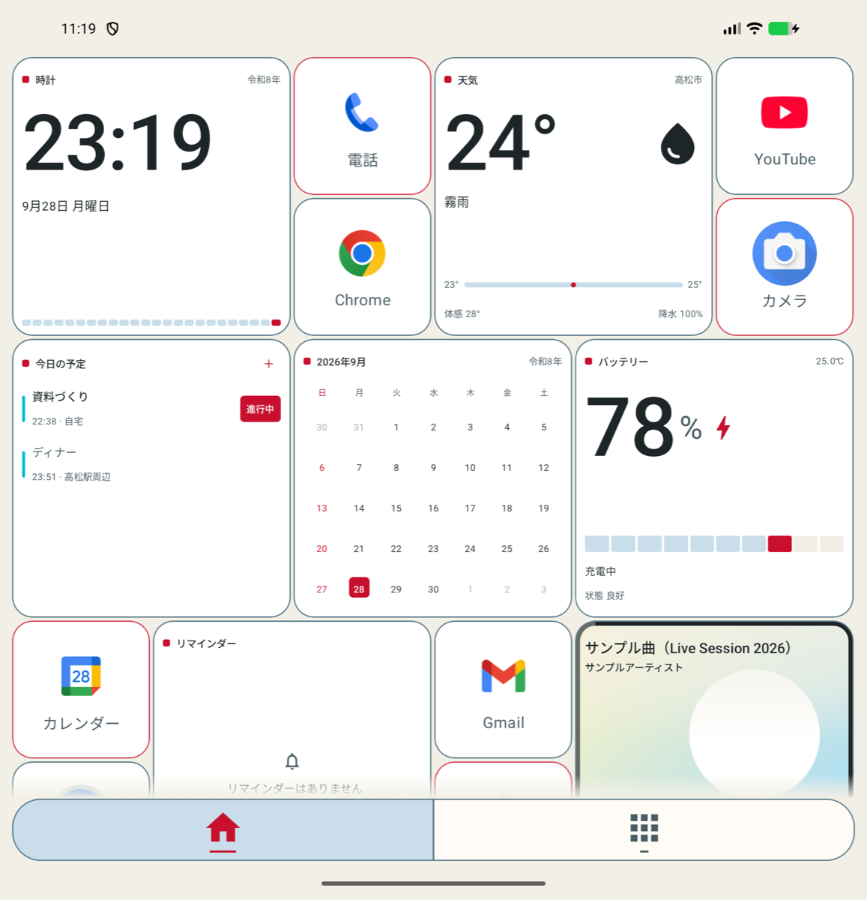
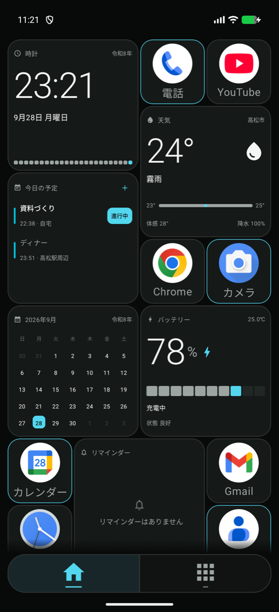

# FiiLDA Launcher

Galaxy Z Foldなどの折りたたみ端末向けの、Androidホームアプリ（ランチャー）です。
閉じた状態のカバー画面と、開いた状態の内側画面のどちらにも合わせて、アプリとウィジェットを並べられます。

このリポジトリは**アプリの配布用**です。インストール用のファイル（APK）は [Releases](../../releases) にあります。

  
  

  
  

## できること

- カバー画面・内側画面（縦／横）に自動で合わせるホーム
- アプリとウィジェットを同じホームに並べ、長押しで移動・サイズ変更
- 現在地の天気と週間天気予報、今日の予定、バッテリー、時計、カレンダーのウィジェット
- 再生中の音楽を操作できるメディアウィジェット
- 5つのテーマ：デフォルト／Classic／窓／マテリアル／ガラス
- 検索つきのアプリ一覧、フォルダ、アプリのショートカット、通知の表示

## インストール方法

1. [Releases](../../releases) を開き、最新版の `FiiLDA-Launcher-v○○.apk` をスマートフォンでダウンロードします。
2. ダウンロードしたファイルを開きます。「提供元不明のアプリ」の確認が出たら、ブラウザやファイルアプリに許可してください。
3. インストール後、「設定 ＞ アプリ ＞ デフォルトのアプリ ＞ ホームアプリ」で **FiiLDA Launcher** を選びます。

必要な環境：Android 10以降。折りたたみ端末向けに作っていますが、通常のスマートフォンでも動きます。

## 使う権限

| 権限 | 使い道 |
| --- | --- |
| おおよその位置情報 | 天気ウィジェット（位置は約1km単位に丸めて [Open-Meteo](https://open-meteo.com/) に送ります） |
| カレンダー | 今日の予定ウィジェット |
| 通知へのアクセス | 音楽の操作と、アプリの通知の表示 |
| 連絡先・写真と動画 | アプリ一覧の検索、フォトフレームウィジェット |

どの権限も、使うウィジェットや機能を初めて使うときにだけ確認します。許可しなくてもホームアプリとしては使えます。

## 注意

- 個人が作っているアプリです。動作の保証はありません。
- 開発用のテスト版を入れている場合は、署名が違うため上書きできません。テスト版を削除してから入れてください（ホームの配置は消えます）。

## ライセンス

[MIT License](LICENSE)
