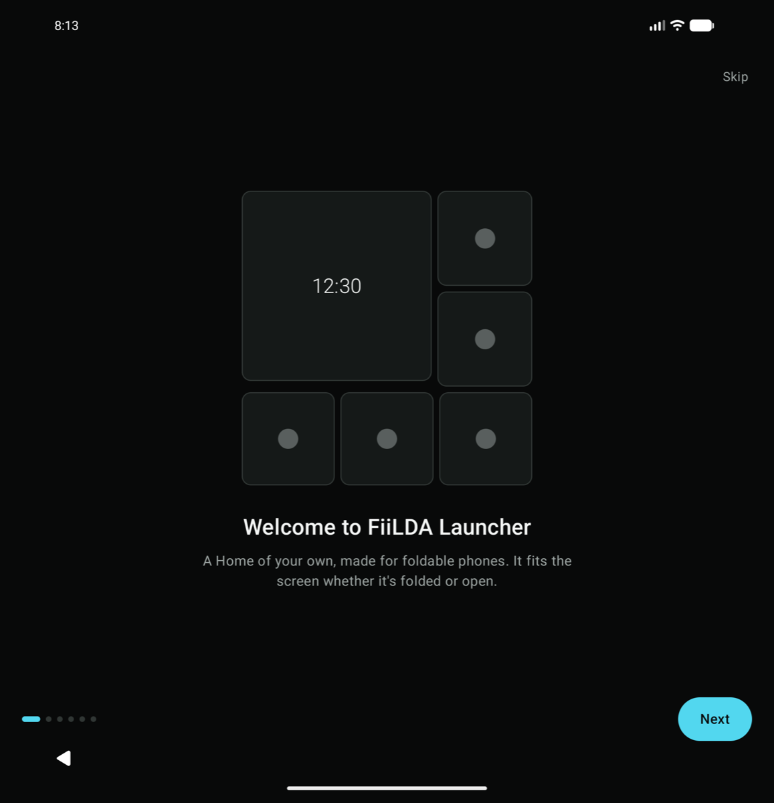
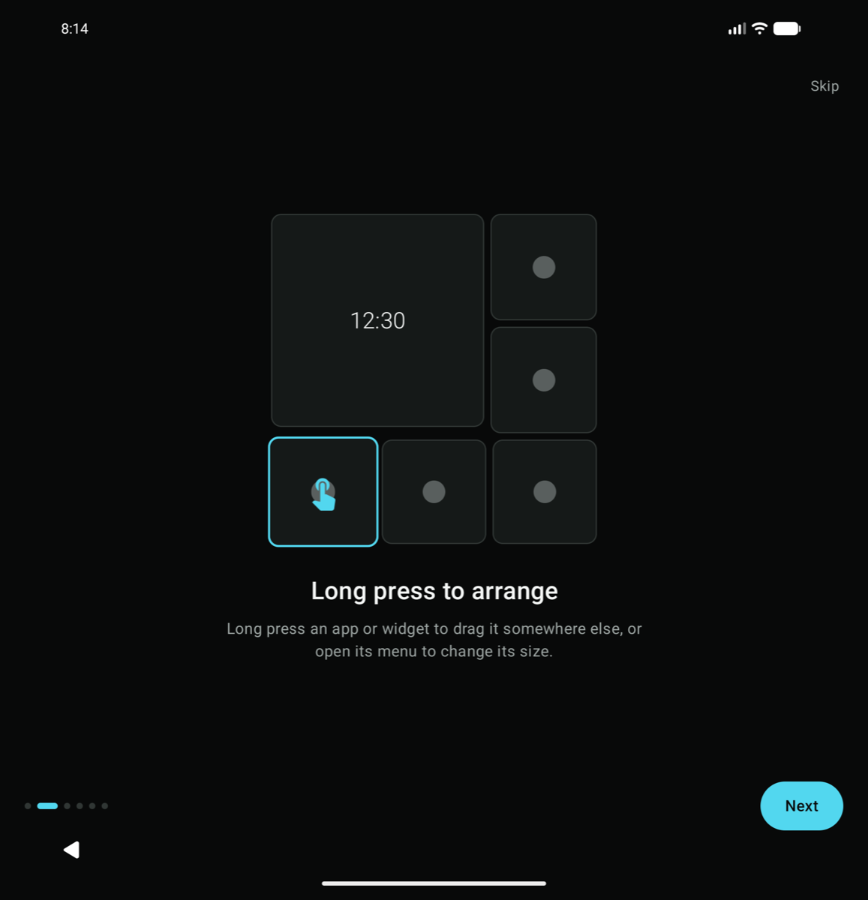
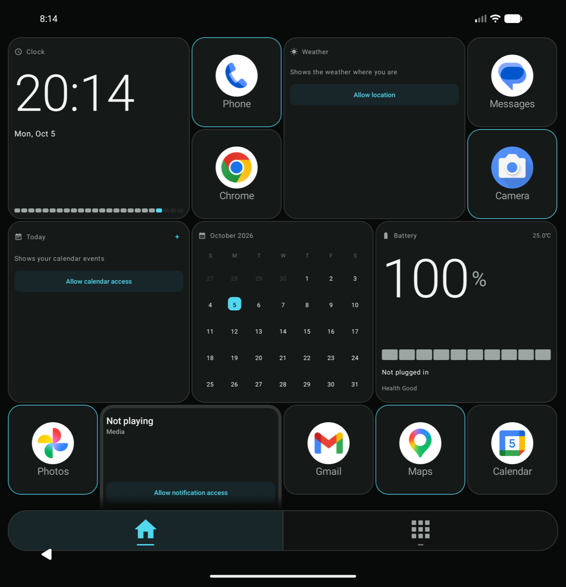
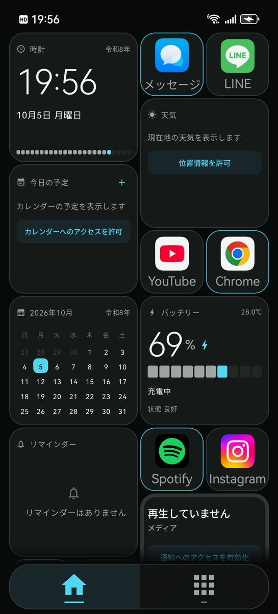

# FiiLDA Launcher

**English** · [日本語](#日本語)

A home screen (launcher) app for Android foldables such as the Galaxy Z Fold.
It arranges apps and widgets on both the cover screen and the inner screen.

This repository holds the **source code** and the **downloads**. Get the APK from [Releases](../../releases).

<p>
  
  
</p>
<p>
  
  
</p>

## First start

The first time you open FiiLDA, a short tutorial walks you through it — just swipe. You can replay it anytime from **Settings > How to use**.
A fresh install starts with one page, six widgets, and up to eight of your phone's default apps.

<p>
  
  
  
</p>

It also works on regular (non-folding) phones:



## Features

- Home that adapts to the cover screen and the inner screen (portrait and landscape)
- Apps and widgets on the same Home; long press to move or resize
- Widgets for local weather and a weekly forecast, today's events, battery, clock, and calendar
- A media widget for controlling what's playing
- Five themes: Default, Classic, Windows, Material, and Glass
- App list with search, folders, app shortcuts, and notifications on tiles
- English and Japanese
- A first-start tutorial

## Install

1. Open [Releases](../../releases) and download the latest `FiiLDA-Launcher-v*.apk` on your phone.
2. Open the downloaded file. If asked about installing unknown apps, allow it for your browser or file app.
3. After installing, go to **Settings > Apps > Default apps > Home app** and choose **FiiLDA Launcher**.

Requires Android 10 or later. It is made for foldables but also works on regular phones.

## Language

FiiLDA shows Japanese when your phone's language is Japanese, and English otherwise.
On Android 13 and later you can change the language of FiiLDA alone in your phone's **App languages** setting (Galaxy: Settings > General management > App languages; Pixel: Settings > System > Languages > App languages).

The English text is new. If something reads oddly or doesn't fit, please [report it](../../issues/new/choose) — screenshots help a lot.

## Permissions

| Permission | Used for |
| --- | --- |
| Approximate location | The weather widget (rounded to about 1 km and sent to [Open-Meteo](https://open-meteo.com/)) |
| Calendar | Today's events widget |
| Notification access | Media controls and notifications on tiles |
| Contacts, photos and videos | App list search and the photo frame widget |

Each permission is asked only when you first use the widget or feature that needs it. FiiLDA works as a home app without any of them.

## Feedback

Found a bug, an odd translation, or text that doesn't fit? Please open an issue from [here](../../issues/new/choose).
English is fine. The developer reads Japanese, so short and simple sentences with a screenshot are the most helpful.

## Source code and contributing

The Android app is in [`android-launcher/`](android-launcher). It is a Kotlin / Jetpack Compose project (Android 10+, compileSdk 36).

```sh
cd android-launcher
./gradlew :app:testDebugUnitTest :app:assembleDebug
```

- [`android-launcher/README.md`](android-launcher/README.md): features and build details (Japanese)
- [`android-launcher/ARCHITECTURE.md`](android-launcher/ARCHITECTURE.md): which file owns what
- [`AGENTS.md`](AGENTS.md): coding principles for this project

Layout fixes for other foldables (Xiaomi, OPPO, Honor, Pixel, …) are very welcome. Please include your device model and screen sizes, and before/after screenshots of the cover and inner screens. Debug builds run much slower than release builds, so judge smoothness with a release or `profiling` build (`./gradlew :app:assembleProfiling`).

## Notes

- This is a personal project. It comes with no warranty.
- If you installed a development build, it can't be updated by a release build because the signatures differ. Uninstall it first (your Home layout will be lost).

## License

[MIT License](LICENSE)

---

# 日本語

Galaxy Z Foldなどの折りたたみ端末向けの、Androidホームアプリ（ランチャー）です。
閉じた状態のカバー画面と、開いた状態の内側画面のどちらにも合わせて、アプリとウィジェットを並べられます。

このリポジトリには、**ソースコード**と**配布用のファイル**があります。インストール用のファイル（APK）は [Releases](../../releases) にあります。

## はじめて開いたとき

初めて開くと、スワイプでめくる短いチュートリアルが表示されます。設定の「使い方を見る」から、いつでもまた見られます。
インストール直後のホームは、1ページ・ウィジェット6個・端末の標準アプリ最大8個から始まります。折りたたみではない普通のスマホでも使えます（上のスクショ参照）。

## できること

- カバー画面・内側画面（縦／横）に自動で合わせるホーム
- アプリとウィジェットを同じホームに並べ、長押しで移動・サイズ変更
- 現在地の天気と週間天気予報、今日の予定、バッテリー、時計、カレンダーのウィジェット
- 再生中の音楽を操作できるメディアウィジェット
- 5つのテーマ：デフォルト／Classic／窓／マテリアル／ガラス
- 検索つきのアプリ一覧、フォルダ、アプリのショートカット、通知の表示
- 日本語と英語に対応
- 初回のチュートリアル

## インストール方法

1. [Releases](../../releases) を開き、最新版の `FiiLDA-Launcher-v○○.apk` をスマートフォンでダウンロードします。
2. ダウンロードしたファイルを開きます。「提供元不明のアプリ」の確認が出たら、ブラウザやファイルアプリに許可してください。
3. インストール後、「設定 ＞ アプリ ＞ デフォルトのアプリ ＞ ホームアプリ」で **FiiLDA Launcher** を選びます。

必要な環境：Android 10以降。折りたたみ端末向けに作っていますが、通常のスマートフォンでも動きます。

## 表示言語

端末の言語が日本語なら日本語、それ以外は英語で表示します。Android 13以降は「アプリの言語」の設定で、FiiLDAだけ言語を変えられます。

## 使う権限

| 権限 | 使い道 |
| --- | --- |
| おおよその位置情報 | 天気ウィジェット（位置は約1km単位に丸めて [Open-Meteo](https://open-meteo.com/) に送ります） |
| カレンダー | 今日の予定ウィジェット |
| 通知へのアクセス | 音楽の操作と、アプリの通知の表示 |
| 連絡先・写真と動画 | アプリ一覧の検索、フォトフレームウィジェット |

どの権限も、使うウィジェットや機能を初めて使うときにだけ確認します。許可しなくてもホームアプリとしては使えます。

## 不具合の報告

不具合や気になる表示があれば、[こちら](../../issues/new/choose)から報告してください。スクショがあると助かります。

## ソースコード

Androidアプリのコードは [`android-launcher/`](android-launcher) にあります（Kotlin / Jetpack Compose）。ビルド方法と機能の説明は [`android-launcher/README.md`](android-launcher/README.md) を見てください。ほかの折りたたみ端末向けのレイアウト調整など、協力を歓迎します。

## 注意

- 個人が作っているアプリです。動作の保証はありません。
- 開発用のテスト版を入れている場合は、署名が違うため上書きできません。テスト版を削除してから入れてください（ホームの配置は消えます）。

## ライセンス

[MIT License](LICENSE)
